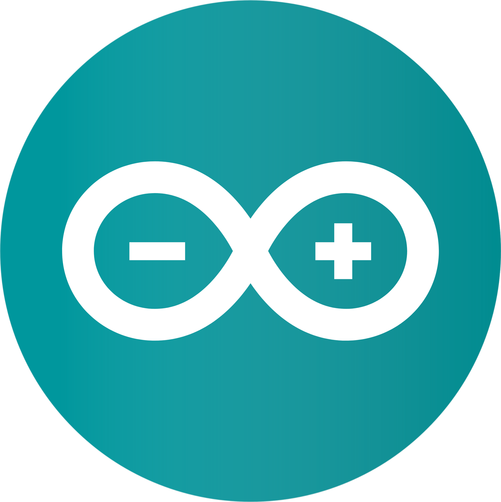
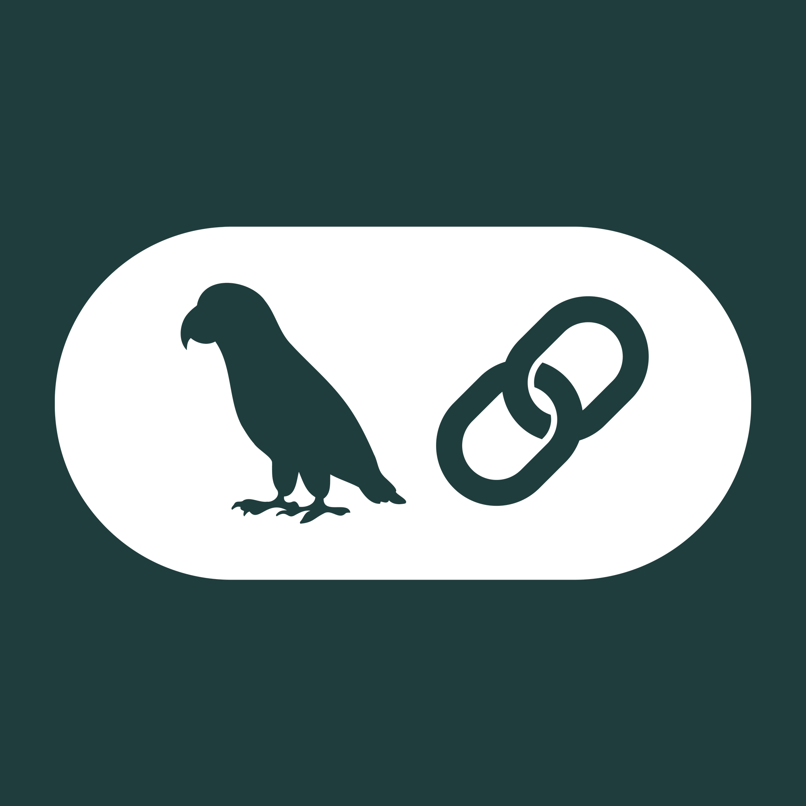
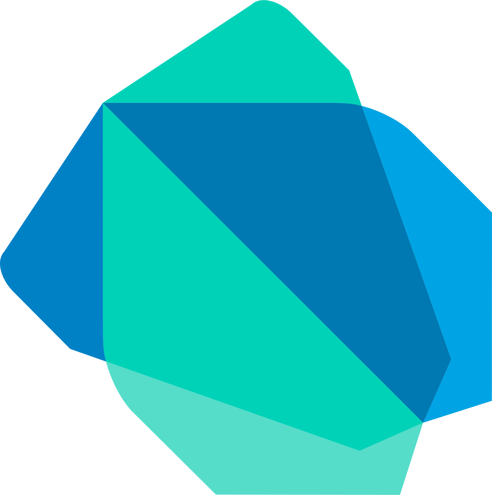

<h1 align="center">🚀 Welcome To My Portfolio! 🚀</h1>

<!-- Portada -->

<!-- Redes de contacto -->

    <!--  -->
    </a>
    
    
    

<!-- Description about me -->
<h2 align="center">🚀 About Me</h2>

🥇 As a developer, my greatest motivation is continuous learning. I consider myself self-taught, always striving to improve my skills and stay up to date with the latest technologies.
 
🎓 I am an Electronic Engineer and a Specialist in Gas Engineering. Over the past three years, I’ve developed a deep passion for programming, exploring various development technologies and expanding my knowledge in this fascinating field.
 
💼 I have two years of experience as a full-stack developer, working at a company focused on the development and maintenance of a POS (Point of Sale) billing and accounting system. Additionally, as a freelance developer, I’ve gained over three years of experience creating tailored solutions for different sectors.

 

<!-- languajes and skills section -->
<h2 align="center" href="https://www.linkedin.com/in/joseisaacalvarez/">
  
  Languages/Frameworks I master:
</h2>
<!-- <h2 align="center">🤖 Languages ​​/ Frameworks I master:</h2> -->

    <code></code>
    <code></code>
    <code></code>
    <code></code>
    <code></code>
    <code></code>
    <code></code>
    <code></code>
    <code></code>
    <code></code>
    <code></code>
    <code></code>
    <code></code> 
    <code></code>   
    <code></code>
    <code></code>

 
<h2 align="center" href="https://www.linkedin.com/in/joseisaacalvarez/">
    
    Databases that I master:
  </h2>
<!-- <h2 align="center">📚 Databases that I master:</h2> -->

    <code></code>    
    <code></code>    

 

<h2 align="center" href="https://www.linkedin.com/in/joseisaacalvarez/">
  
  Languages/Frameworks I'm learning:
</h2>
<!-- <h2 align="center">📚 Languages/Frameworks I'm learning:</h2> -->

    <code></code>
    <code></code>
    <code></code>
    <code></code>
    <code></code>    
    <code></code>    

 

<h2 align="center">
  
  Environments I work with:
</h2>

    <code></code>
    <code></code>
    <code></code>
    <code></code>
    <code></code>
    <code></code>
    <code></code>
    <code></code>
    <code></code>
    <code></code>

<!-- GitHub stats section -->

## 📊 GitHub Stats

   
  
  
   

